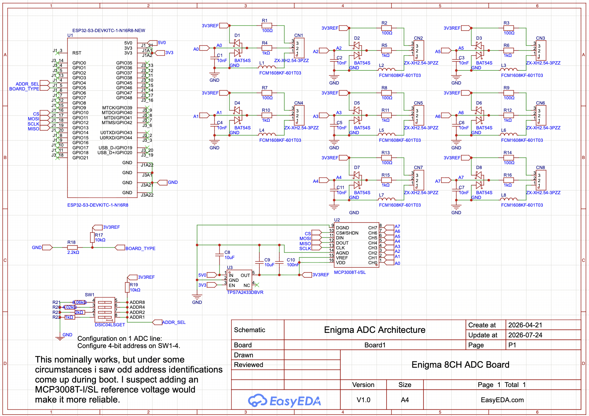
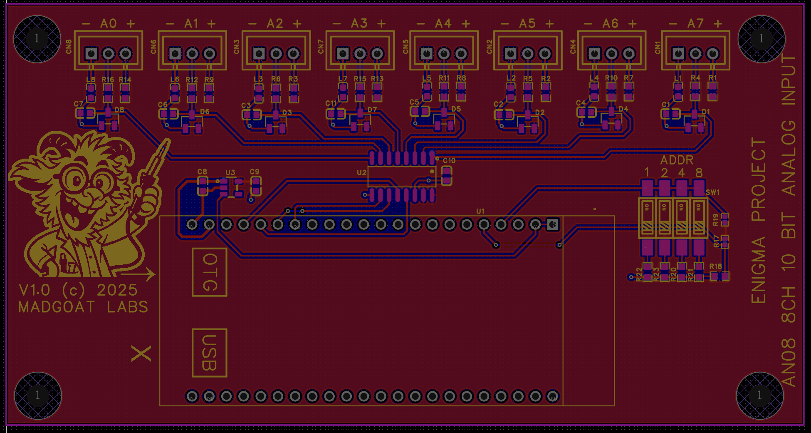
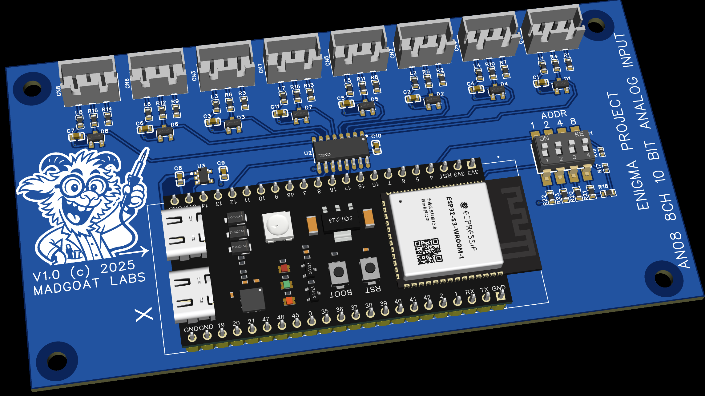

# AN08

## Notes

Connect analog sources via 3P JST-XH connectors.  Unused channels should be given a
Dongle to loop the center pin to either rail to prevent spurious reports.

## Schematic

## PCB Layout

## 3D View

## Files

- Editable source: [`an08_easyeda.epro2`](an08_easyeda.epro2) (open in [EasyEDA Pro](https://easyeda.com), free)
- Fabrication output: [`an08_gerber.zip`](an08_gerber.zip)
- Bill of materials: [`an08_bom.csv`](an08_bom.csv)

Licensed under CERN-OHL-S-2.0 (see [`../LICENSE`](../LICENSE)).
