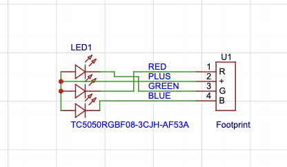
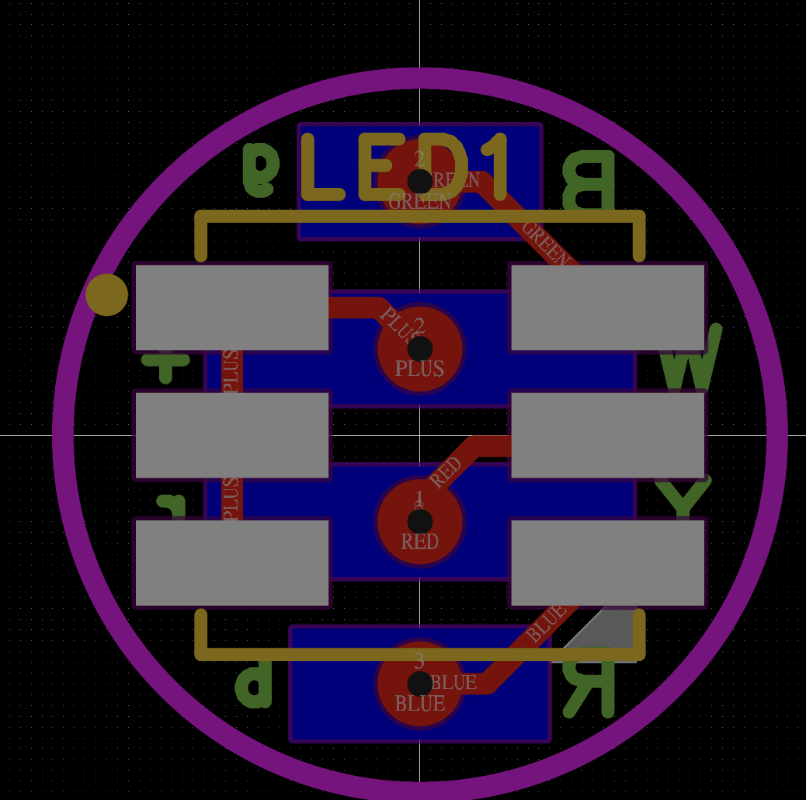
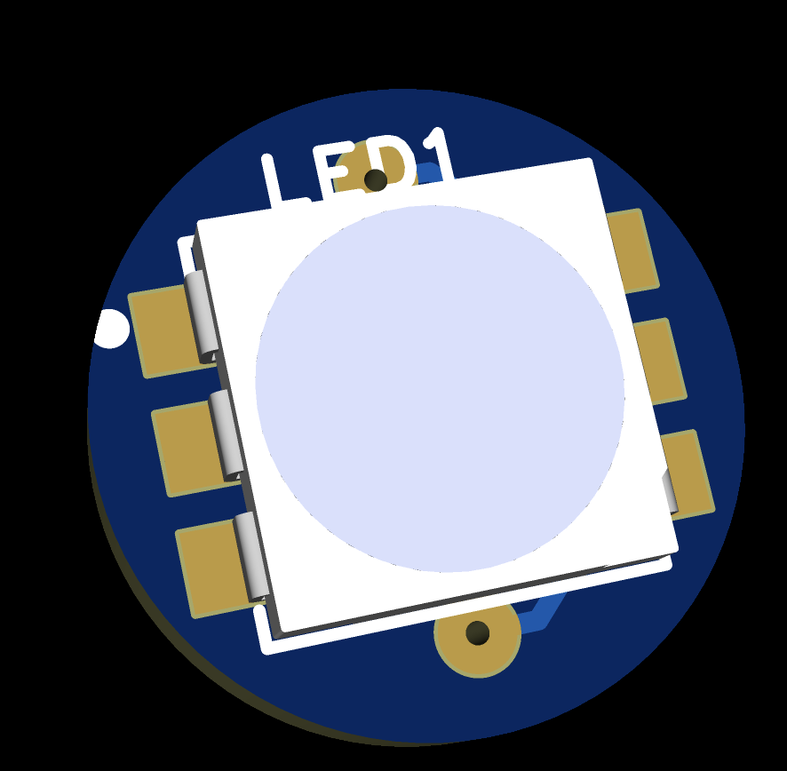

# LED Indicator

## Notes

YMMV on wire colors; different JST-XH manufacturers use different schemes.

## Schematic

## PCB Layout

## 3D View

## Files

- Editable source: [`led_indicator_easyeda.epro2`](led_indicator_easyeda.epro2) (open in [EasyEDA Pro](https://easyeda.com), free)
- Fabrication output: [`led_indicator_gerber.zip`](led_indicator_gerber.zip)
- Bill of materials: [`led_indicator_bom.csv`](led_indicator_bom.csv)

Licensed under CERN-OHL-S-2.0 (see [`../LICENSE`](../LICENSE)).
