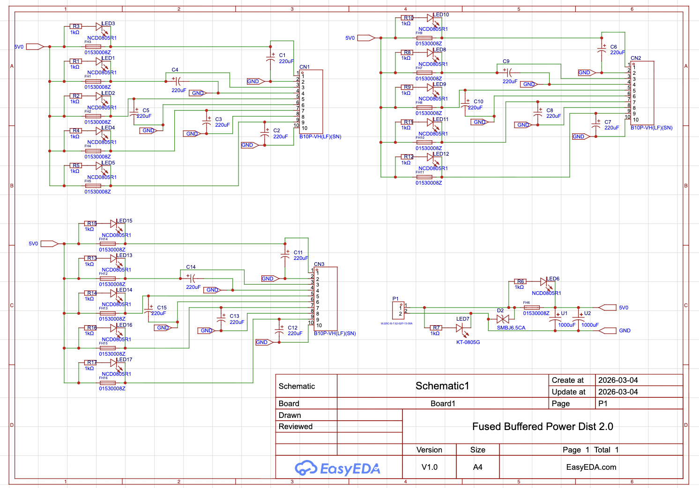
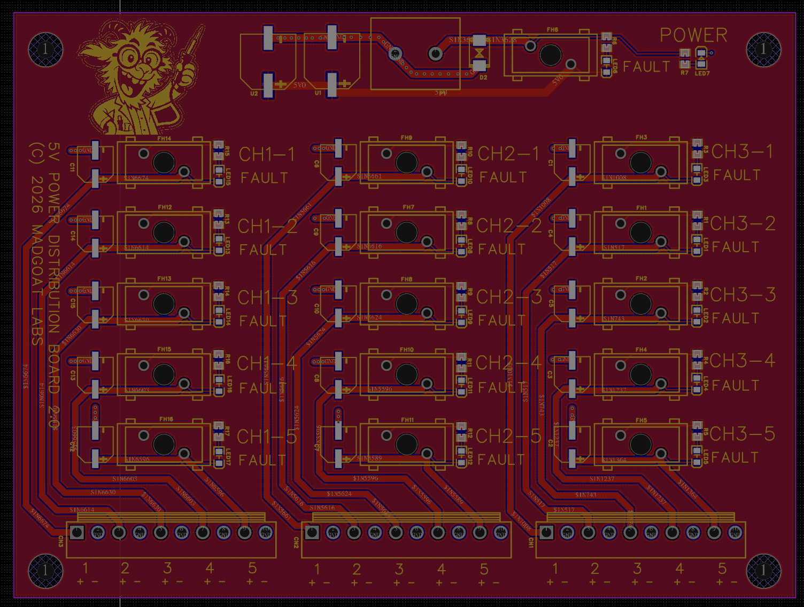
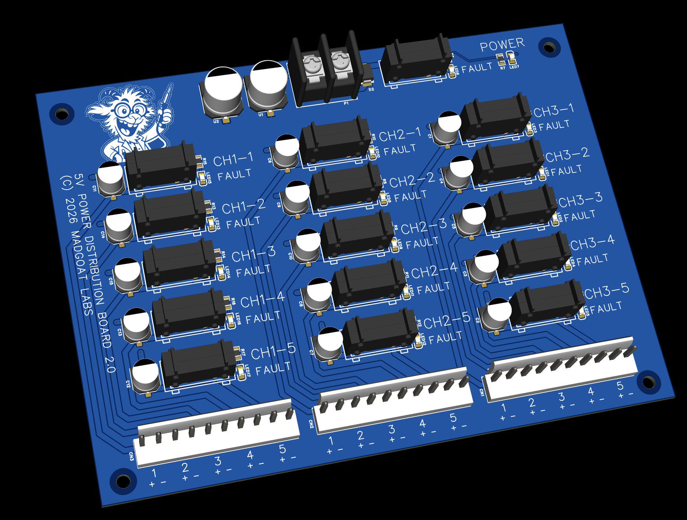

# Power Fused 5V0 Distro Board

## Notes

Fault LEDs will light on blown or missing fuses only for connected channels.

## Schematic

## PCB Layout

## 3D View

## Files

- Editable source: [`power_fused_5v0_easyeda.epro2`](power_fused_5v0_easyeda.epro2) (open in [EasyEDA Pro](https://easyeda.com), free)
- Fabrication output: [`power_fused_5v0_gerber.zip`](power_fused_5v0_gerber.zip)
- Bill of materials: [`power_fused_5v0_bom.csv`](power_fused_5v0_bom.csv)

Licensed under CERN-OHL-S-2.0 (see [`../LICENSE`](../LICENSE)).
