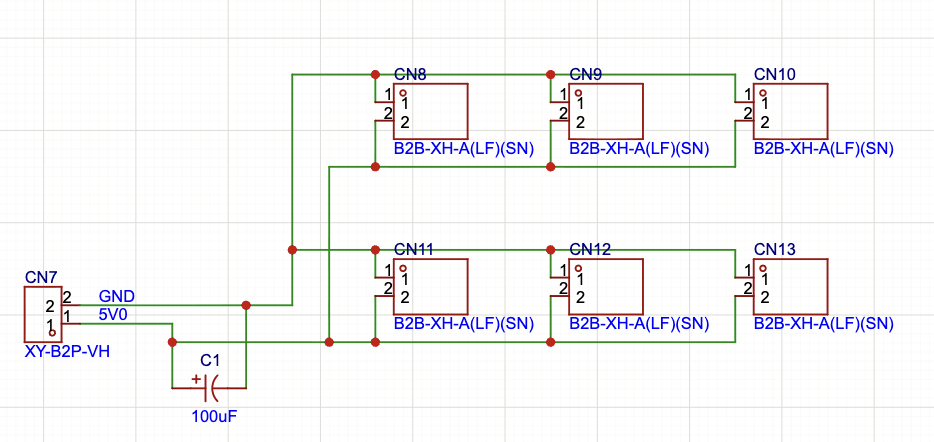
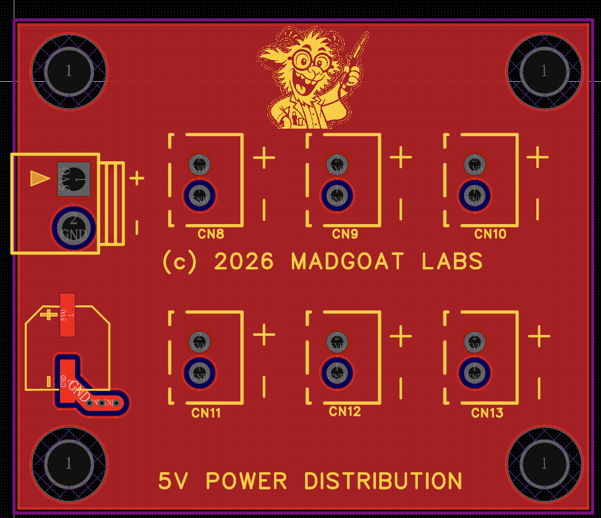
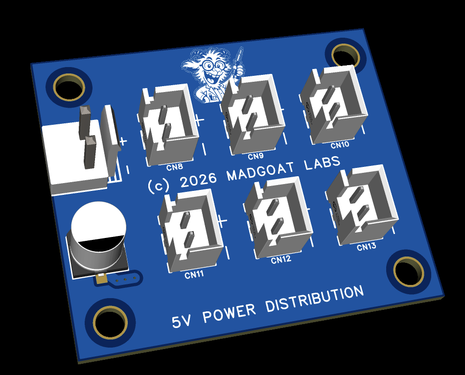

# Power Panel Distro Board

## Notes

This is for local distribution of 5V0 within a single panel.  This can be for
Enigma boards, RPIs, ,small LCD screens, etc.  Use 2P JST-XH.

## Schematic

## PCB Layout

## 3D View

## Files

- Editable source: [`power_panel_distro_easyeda.epro2`](power_panel_distro_easyeda.epro2) (open in [EasyEDA Pro](https://easyeda.com), free)
- Fabrication output: [`power_panel_gerber.zip`](power_panel_gerber.zip)
- Bill of materials: [`power_panel_distro_bom.csv`](power_panel_distro_bom.csv)

Licensed under CERN-OHL-S-2.0 (see [`../LICENSE`](../LICENSE)).
