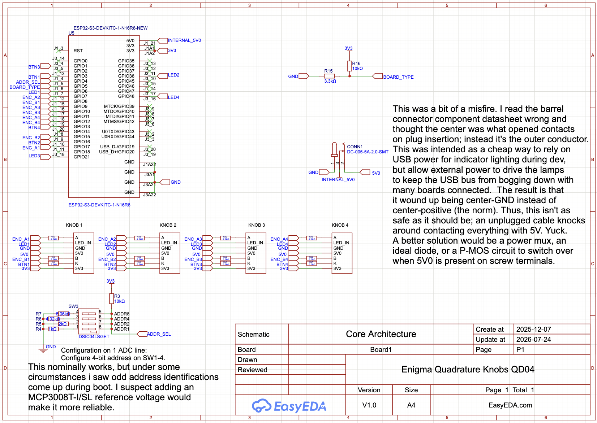
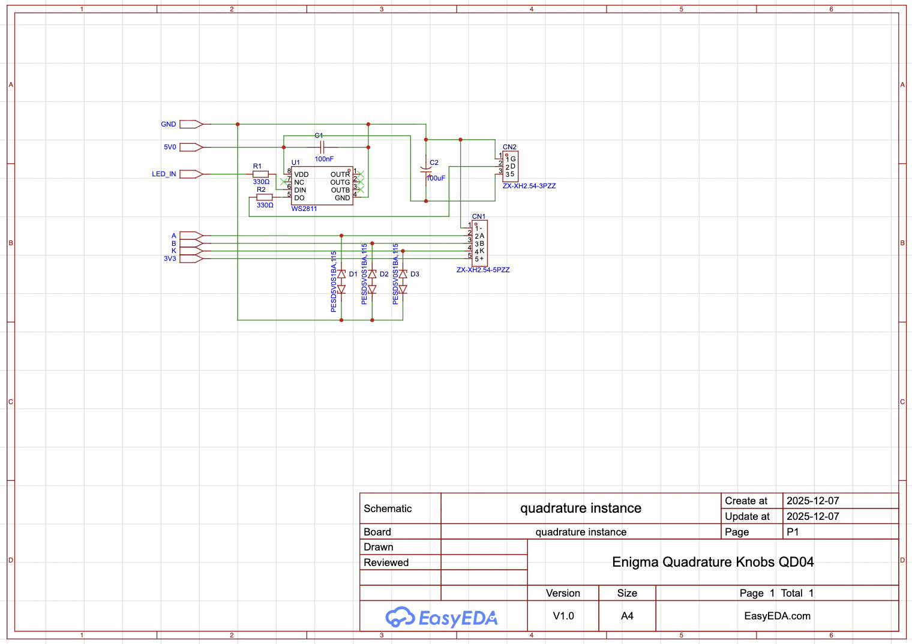
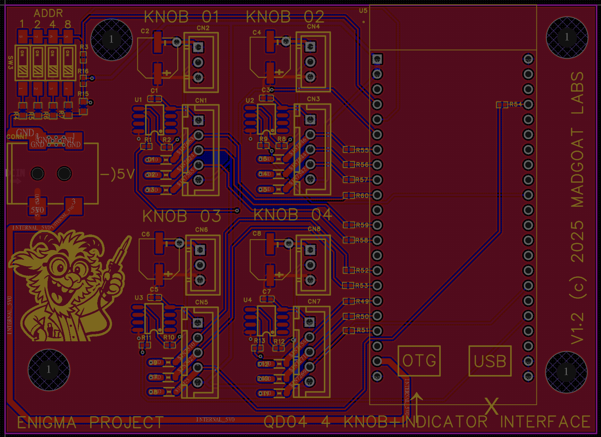
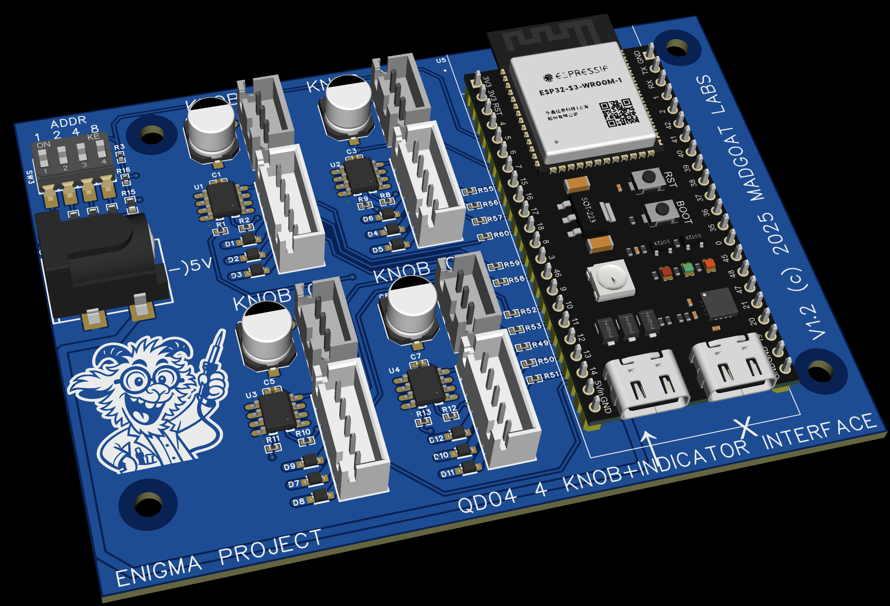

# QD04

## Notes

Each channel uses a 5P JST-XH for the quadrature knob and a 3P JST-XH for the
Addressable LED chain. Keep cable runs short to prevent serial data corruption
on the LEDs. 

> [!NOTE]: Due to a flaw I haven't been able to diagnose, one of the RMT TX channels
> has an odd LED ghosting problem. After a lot of futzing, I still can't figure out
> if it's a hardware or software issue.

> [!NOTE]: I configure my dials to run in the 0x00-0x08 RGB brightness range instead of 0x00-0xFF.
> The associated qd04 LED boards are crazy bright at full 0xFF brightness.  Driving them fully without
> plugging in external 5V0 WILL toast your ESP32 devkit.  A good firmware mod would
> be to accept color data as 0x00-0xFF and >>4 the values before storing in the serialization
> arrays (not at time of config; that would change the NVS CRC footprint). 

## Schematic

## PCB Layout

## 3D View

## Files

- Editable source: [`qd04_easyeda.epro2`](qd04_easyeda.epro2) (open in [EasyEDA Pro](https://easyeda.com), free)
- Fabrication output: [`qd04_gerber.zip`](qd04_gerber.zip)
- Bill of materials: [`qd04_bom.csv`](qd04_bom.csv)

Licensed under CERN-OHL-S-2.0 (see [`../LICENSE`](../LICENSE)).
