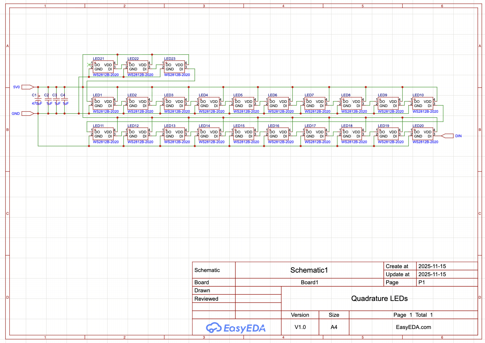
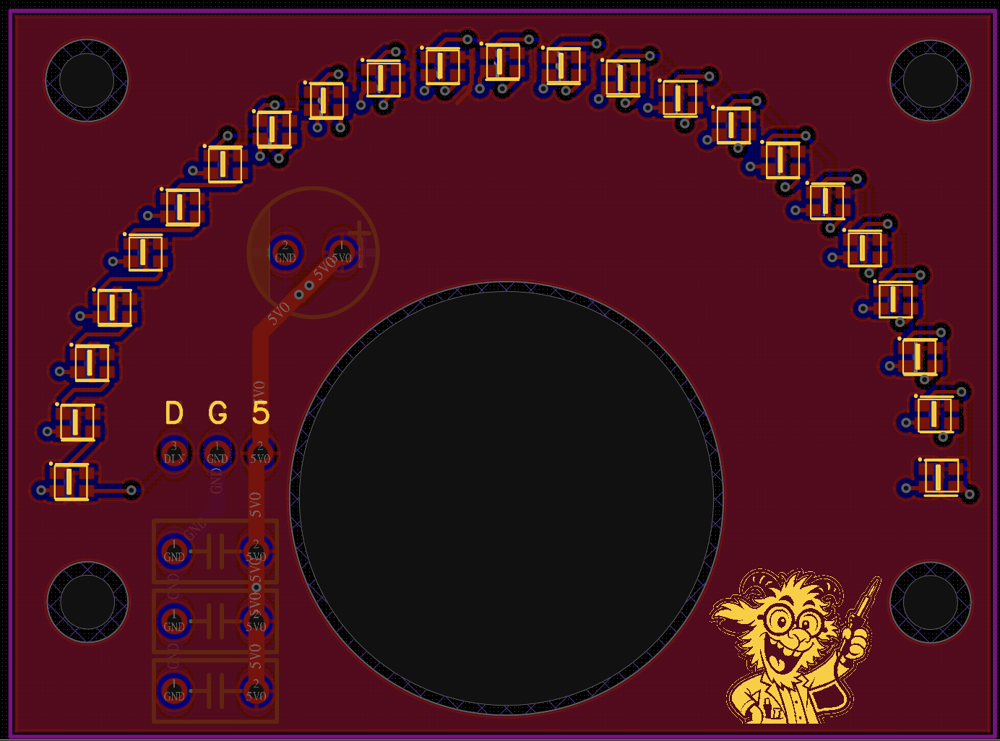
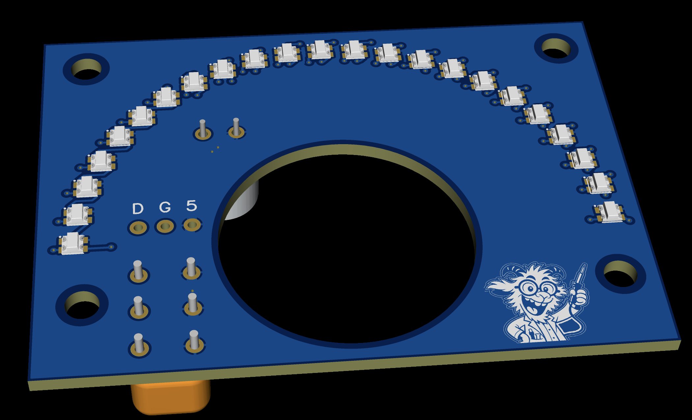

# QD04 Dial LED Board

## Notes

Mount capacitors on the back of the board and trim their leads on the front so
they don't interfere with panel mounting.  The included LightBurn file includes
lasercutting templates to stack the PCB into a mountable assembly.

## Schematic

## PCB Layout

## 3D View

## Files

- Editable source: [`qd04_dial_leds_easyeda.epro2`](qd04_dial_leds_easyeda.epro2) (open in [EasyEDA Pro](https://easyeda.com), free)
- Fabrication output: [`qd04_dial_led_gerber.zip`](qd04_dial_led_gerber.zip)
- Bill of materials: [`qd04_dial_leds_bom.csv`](qd04_dial_leds_bom.csv)
- Mechanical (laser-cut, LightBurn): [`dial_laser_cuts.lbrn2`](dial_laser_cuts.lbrn2)

Licensed under CERN-OHL-S-2.0 (see [`../LICENSE`](../LICENSE)).
