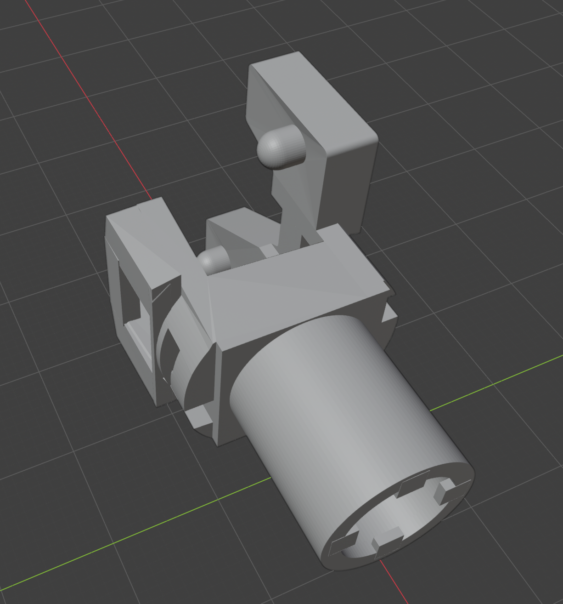
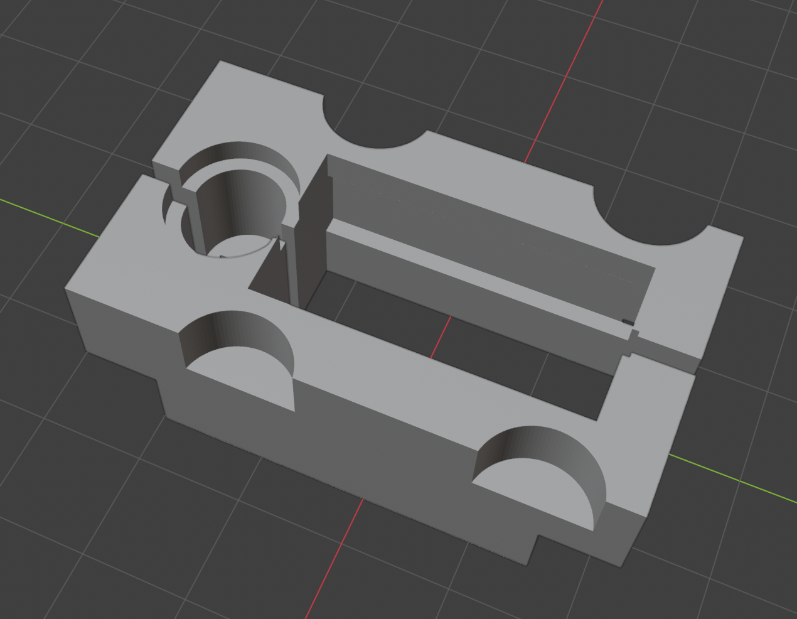
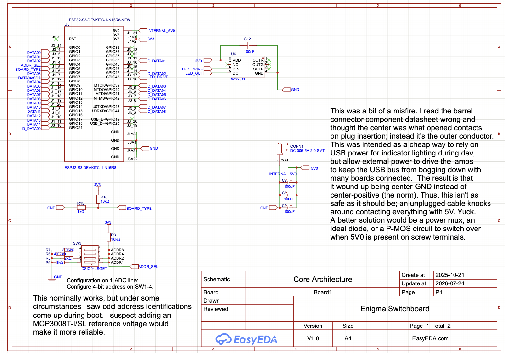
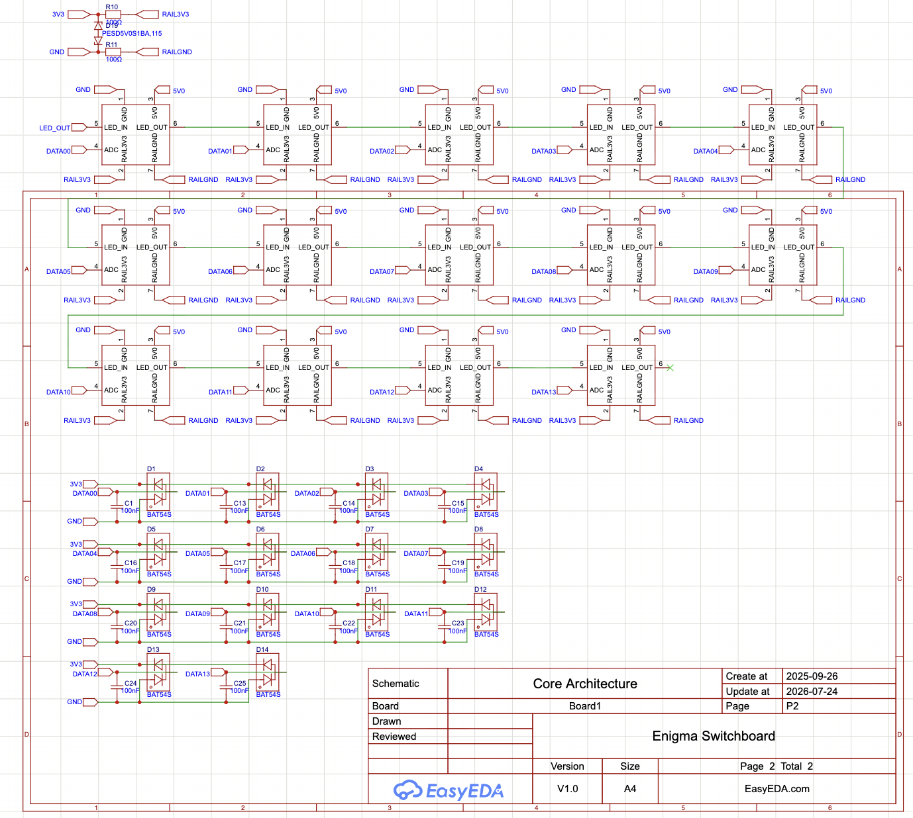
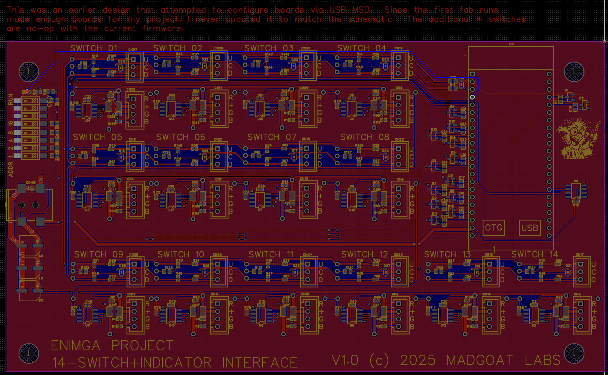
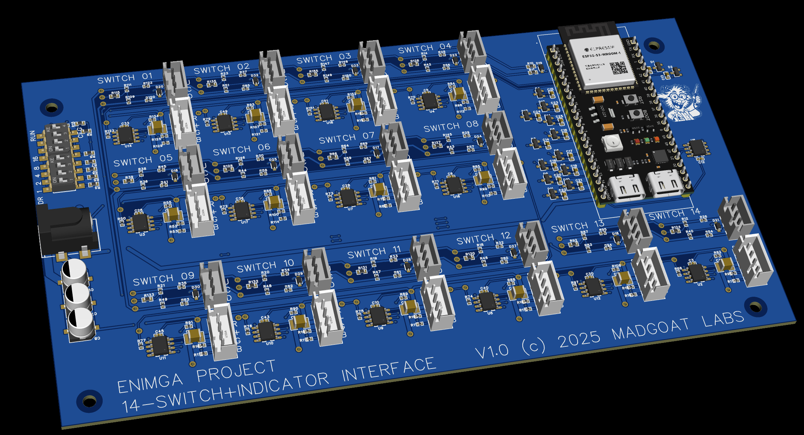

# SW14

## Notes

Each switch channel uses a 3P JST-XH to the switch (center common) and a 4P JST-XH to the
Common Anode RGB LED such as https://www.amazon.com/dp/B01C19ENFK.

LEDs in bezel mounts appear greatly brighter than LEDs inside illuminated pushbuttons.

### Illuminated pushbuttons
Usually these have a single color LED. The [included STL file](illuminated_button_rgb_mount.stl) is imperfect, but with
a little trimming it's worked fine for me with dozens of buttons.
Different button manufacturers have slightly different form factors.
I used https://www.amazon.com/dp/B071L5QBSX. YMMV.

### Toggle switches
Any single-throw or double-throw switch will work here. If you're using
Single-throw, just connect the center (common) pin of the JST-XH to either
one of the other pins.  If you declare only one of the state_1/state_2
configurations in your JSON config, the other one will automatically
be added identically.

I chose momentary-off-momentary double-throw switches because they
can be configured in JSON to hold state as if they were on-off-on.
And because they automatically return to center, the hardware itself
isn't stateful and a new game can be soft-started without returning
all the switches to a neutral position manually. 

The included STL files [1](switch_retainer_bracket_left.stl) [2](switch_retainer_bracket_right.stl) are designed to both capture a panel
mount LED (the bezels I bought at https://www.amazon.com/dp/B0974DL4QR 
do not hold the LED securely) and keep the switch (https://www.amazon.com/dp/B0CYPJ2JX7)
from rotating. They also provide strain relief on the LED wires.

## Schematic

## PCB Layout

## 3D View

## Files

- Editable source: [`sw14_easyeda.epro2`](sw14_easyeda.epro2) (open in [EasyEDA Pro](https://easyeda.com), free)
- Fabrication output: [`sw14_gerber.zip`](sw14_gerber.zip)
- Bill of materials: [`sw14_bom.csv`](sw14_bom.csv)
- Mechanical (3D-print): `illuminated_button_rgb_mount.stl`, `switch_retainer_bracket_left.stl`, `switch_retainer_bracket_right.stl`

Licensed under CERN-OHL-S-2.0 (see [`../LICENSE`](../LICENSE)).
