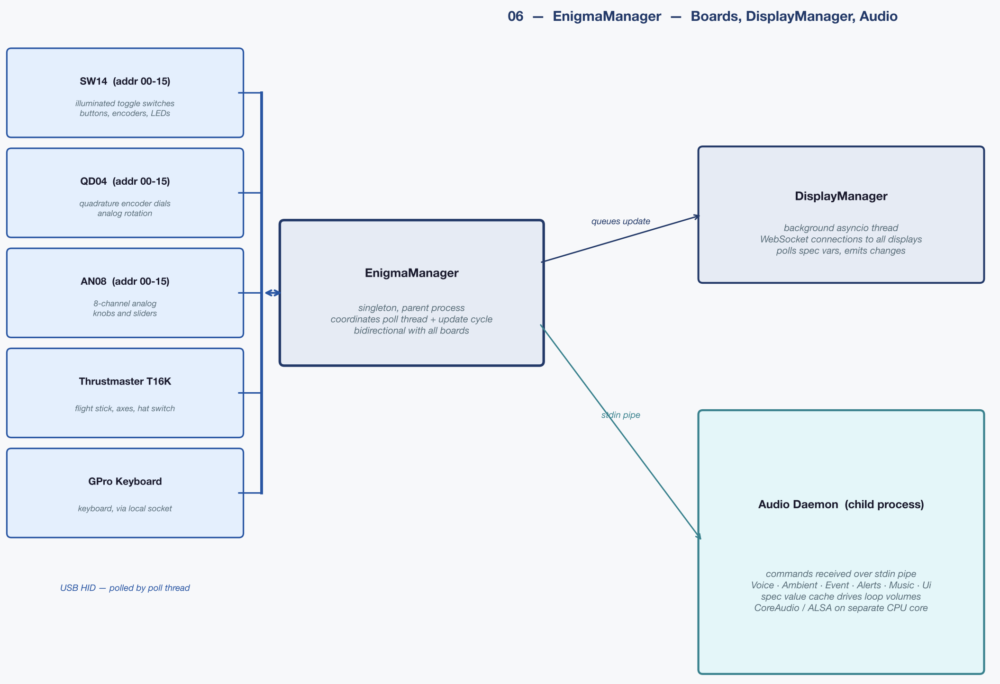
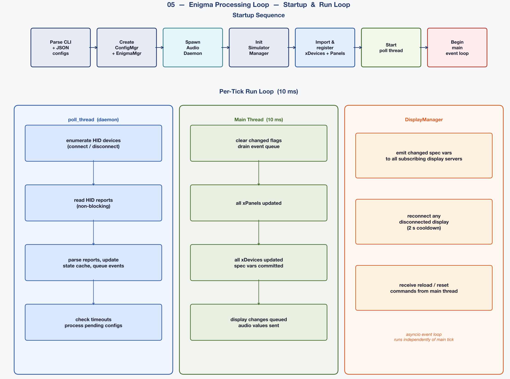
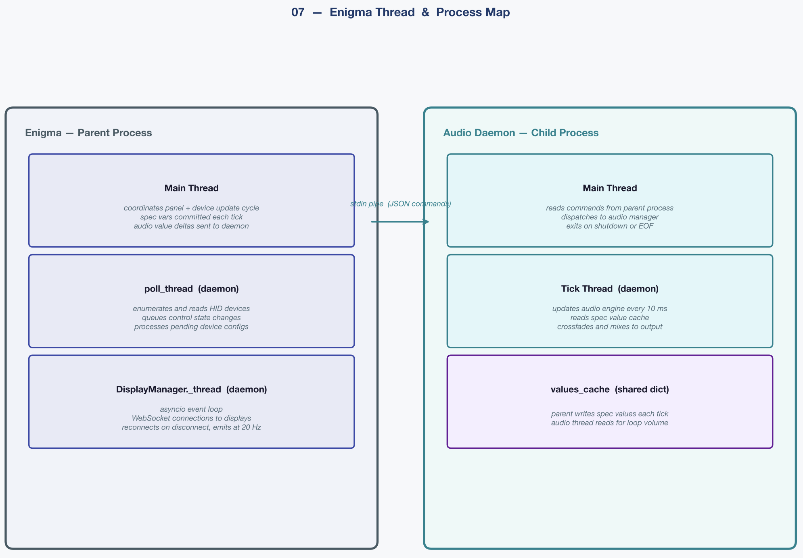
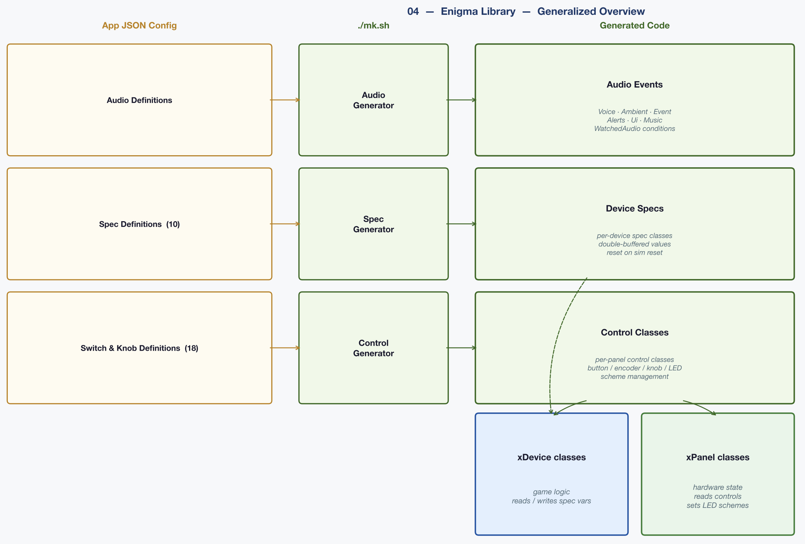

# Enigma Library: Design Guide

This guide walks through how the Enigma library is structured and how to use it.
The example builds a small but complete working panel from scratch, touching every
major subsystem.

---

## Philosophy

Writing hardware-facing sim code the direct way (reading raw HID reports, packing
byte buffers, manually synchronizing values between your logic and your displays)
is tedious, error-prone, and unfriendly to anyone who isn't deeply comfortable with
low-level Python. Enigma exists to eliminate that layer.

The core idea is **declare first, code second**. You describe your hardware, your
game state, and your display outputs in JSON. The library generates Python classes
from those declarations. Your actual sim code then reads and writes values through
those generated classes in plain, readable Python: no byte-packing, no HID
negotiation, no WebSocket management. The library handles all of that.

The generated classes are entirely optional. If you prefer to call the underlying
API directly, you can; everything is accessible. But I find that the
generated layer makes the code dramatically shorter and easier to reason about,
especially when multiple people are working on different panels.

---

## The Three Config Layers

Enigma is driven by three kinds of JSON configuration.

### 1. Hardware panel config

Declares the physical controls (switches, encoders, analog axes) and how they
are wired to Enigma boards. Each config file maps to one logical **panel**, which
can span multiple physical boards. When two or more board configs share the same
`name`, all their controls are merged into one generated class.

One JSON file per board, files live in `configs/`.

### 2. Spec var config

Declares the **game state**: the shared variables "Specification" that every part of the sim
reads and writes. Spec vars are the single source of truth. A control panel writes
to them; a display reads from them; your simulation logic reads and writes them;
the audio system reacts to them. Nobody passes values around directly.

One JSON file per logical subsystem, files live in `configs/`.

### 3. Display config

Declares what each display receives. You list which spec vars a display subscribes
to, and the library transmits their current values automatically over WebSocket
whenever they change. No transmission code required.

Displays are optional: an application can run with none. A display is anything
that can hold a socket open, on the same machine or across the network: a local
game-engine screen (Unity, Unreal, Godot), a browser page, an LED matrix, or a
small networked screen on a Raspberry Pi.

One JSON file per display, files live in `configs/`.

---

## A Complete Example: Engine Control Panel

Here we'll build a complete panel for a spacecraft engine management station. It
uses all three Enigma board types: SW14 for switches, QD04 for encoder knobs, and
AN08 for analog axes.

### Designing the hardware

Our panel has three boards. All three share the panel name `"EngineControl"`; the
generator merges them into one class.

**EngineControlSwitches.json** (SW14 board, address 00)

```json
{
  "name": "EngineControl",
  "controls": [
    {
      "control_num": 1,
      "name": "EngineArm",
      "desc": "Engine arm / safe",
      "type": "toggle",
      "default_state": 0,
      "state_0": { "report": 1, "value": "safe",  "colors": "#060000" },
      "state_1": { "report": 1, "value": "armed",  "colors": "#000600" }
    },
    {
      "control_num": 2,
      "name": "IgnitionEnable",
      "desc": "Ignition enabled",
      "type": "toggle",
      "default_state": 0,
      "state_0": { "report": 1, "value": "disabled", "colors": "#060606" },
      "state_1": { "report": 1, "value": "enabled", "colors": "#060600", "mode": "blink", "period_ms": 800 },
      "schemes": {
        "online":   { "state_1": { "colors": "#000600" } },
        "warning":  { "state_1": { "colors": "#060600,#000000", "mode": "blink", "period_ms": 600 } },
        "critical": { "state_1": { "colors": "#060000,#000000", "mode": "blink", "period_ms": 150 } }
      }
    },
    {
      "control_num": 3,
      "name": "EngineMode",
      "desc": "Mode: idle",
      "type": "radio",
      "group": 1,
      "default_state": 1,
      "state_0": { "report": 1, "value": "off",    "colors": "#060606" },
      "state_1": { "report": 1, "value": "idle",   "colors": "#000030" }
    },
    {
      "control_num": 4,
      "name": "EngineMode",
      "desc": "Mode: cruise",
      "type": "radio",
      "group": 1,
      "default_state": 0,
      "state_0": { "report": 1, "value": "off",    "colors": "#060606" },
      "state_1": { "report": 1, "value": "cruise", "colors": "#000030" }
    },
    {
      "control_num": 5,
      "name": "EngineMode",
      "desc": "Mode: boost",
      "type": "radio",
      "group": 1,
      "default_state": 0,
      "state_0": { "report": 1, "value": "off",    "colors": "#060606" },
      "state_1": { "report": 1, "value": "boost",  "colors": "#060000" }
    },
    {
      "control_num": 6,
      "name": "EmergencyCutoff",
      "desc": "Emergency engine cutoff",
      "type": "momoffmom",
      "default_state": 0,
      "state_0": { "report": 1, "value": "center", "colors": "#060000" },
      "state_1": { "report": 1, "value": "cutoff", "colors": "#060000", "mode": "blink", "period_ms": 200 }
    }
  ]
}
```

> [!NOTE]
> The three `EngineMode` controls share both `"name": "EngineMode"` and
> `"group": 1`. The shared name causes the library to treat them as one logical
> control; the group number causes the firmware to enforce mutual exclusion.
> When the operator selects any one, the others turn off automatically with no
> host code involved.

**EngineControlKnobs.json** (QD04 board, address 00)

```json
{
  "name": "EngineControl",
  "controls": [
    {
      "control_num": 1,
      "name": "PowerTarget",
      "desc": "Target power output, 0-100%",
      "num_leds": 16,
      "min_value": 0.0,
      "max_value": 100.0,
      "units": "%",
      "dial": {
        "background_mode": "gradient",
        "start_color": "#000020",
        "end_color": "#060200",
        "active_render": "brighten"
      }
    },
    {
      "control_num": 2,
      "name": "FuelMix",
      "desc": "Fuel/oxidiser mix ratio, 0.8-1.4",
      "num_leds": 12,
      "min_value": 0.8,
      "max_value": 1.4,
      "units": "ratio",
      "dial": {
        "background_mode": "ranged",
        "zones": [
          { "threshold": 1,  "color": "#060000" },
          { "threshold": 4,  "color": "#060600" },
          { "threshold": 8,  "color": "#000600" },
          { "threshold": 11, "color": "#060000" }
        ],
        "active_render": "brighten"
      }
    }
  ]
}
```

**EngineControlAxes.json** (AN08 board, address 00)

```json
{
  "name": "EngineControl",
  "controls": [
    {
      "control_num": 1,
      "name": "Throttle",
      "desc": "Main throttle axis",
      "sensor_min_v": 0.83,
      "sensor_max_v": 2.90,
      "gamma": 2.0,
      "deadband": 3,
      "min_value": 0.0,
      "max_value": 1.0
    },
    {
      "control_num": 2,
      "name": "TempLimit",
      "desc": "Maximum temperature setpoint, 500-1200degC",
      "sensor_min_v": 0.0,
      "sensor_max_v": 3.3,
      "deadband": 4,
      "min_value": 500.0,
      "max_value": 1200.0
    }
  ]
}
```

> [!NOTE]
> The Throttle's `sensor_min_v` and `sensor_max_v` are set slightly inside the
> sensor's measured voltage extremes to account for temperature variation. See
> the Sensor Voltage Range section in [AN08_CONFIG.md](AN08_CONFIG.md).

### Defining the spec vars

**EngineSpec.json**

```json
{
  "State": {
    "type": "enum",
    "desc": "Engine operating state",
    "values": ["OFFLINE", "ARMED", "IGNITING", "ONLINE", "FAULT"],
    "default": "OFFLINE"
  },
  "Mode": {
    "type": "enum",
    "desc": "Engine power mode",
    "values": ["IDLE", "CRUISE", "BOOST"],
    "default": "IDLE"
  },
  "PowerTarget": {
    "type": "number",
    "desc": "Commanded power output (%)",
    "default": 0.0,
    "constants": {
      "IDLE_MAX": 20.0,
      "CRUISE_MIN": 20.0,
      "CRUISE_MAX": 80.0,
      "BOOST_MIN": 80.0
    }
  },
  "PowerActual": {
    "type": "number",
    "desc": "Current measured power output (%)",
    "default": 0.0
  },
  "Temperature": {
    "type": "number",
    "desc": "Combustion chamber temperature (degC)",
    "default": 20.0,
    "constants": {
      "NOMINAL": 800.0,
      "WARNING": 1000.0,
      "CRITICAL": 1150.0
    }
  },
  "FuelMixRatio": {
    "type": "number",
    "desc": "Fuel/oxidiser mix ratio",
    "default": 1.0
  },
  "ThrottleInput": {
    "type": "number",
    "desc": "Raw throttle axis input (0-1)",
    "default": 0.0
  },
  "TempLimitSetpoint": {
    "type": "number",
    "desc": "Maximum temperature setpoint (degC)",
    "default": 1000.0
  },
  "ArmEnabled": {
    "type": "bool",
    "desc": "Engine arm switch position",
    "default": false
  },
  "FaultMessage": {
    "type": "string",
    "desc": "Current fault description, empty if none",
    "default": ""
  }
}
```

### Wiring a display

**EngineDisplay.json**

```json
{
  "URL": "http://engine-display-host:8080/update",
  "Publish": [
    "EngineSpec.State",
    "EngineSpec.Mode",
    "EngineSpec.PowerTarget",
    "EngineSpec.PowerActual",
    "EngineSpec.Temperature",
    "EngineSpec.FuelMixRatio",
    "EngineSpec.FaultMessage"
  ]
}
```

That's it. The listed variables will be transmitted to the display automatically
whenever they change. The display's JavaScript receives a `host_update` WebSocket
event with a dict of changed values on each frame.

### Generate the code

```bash
python3 -m enigma.tools.generate_controls --config-dir configs/ --output generated/controls.py
python3 -m enigma.tools.generate_devices  --config-dir configs/ --output generated/devices.py
python3 -m enigma.tools.generate_audio    --config-dir configs/ --output generated/audio_events.py
```

This produces three files:

- `generated/controls.py`: the `EngineControl` class with all controls from all
  three boards merged together
- `generated/devices.py`: the `EngineSpec` class with all the spec vars
- `generated/audio_events.py`: audio event classes (covered in the audio section)

### The Panel class

The panel's job is to keep the physical panel consistent with the current game
state. It reads spec vars and translates them into indicator appearance: which
buttons are lit, which schemes are active, which controls are enabled or
disabled. It also responds to control changes to manage the panel's own
presentation state (for example, arming a switch might enable other controls
that were previously locked out). It never writes to spec vars.

Write all presentation state unconditionally on every call to `update()` rather
than only when something changes. The library is cheap about USB traffic: if a
scheme, enable state, or control value hasn't changed since the last write, no
USB command is issued. Writing every tick is the right default because it
guarantees states are consistent even after a reset, a reconnect, or any other
event that might have left the hardware out of sync.

```python
from enigma.panelmanager import PanelManager
from generated.controls import EngineControl
from generated.devices import EngineSpec


class EnginePanel(PanelManager):

    def update(self):
        # When the arm switch changes, gate the mode and ignition controls.
        # This is a panel-level decision: unarmed = operator can't interact.
        if EngineControl.EngineArm.changed():
            armed = (EngineControl.EngineArm == EngineControl.EngineArm.Values.ARMED)
            EngineControl.IgnitionEnable.Enabled = armed
            EngineControl.EngineMode.Enabled    = armed

        # Keep the ignition button's appearance consistent with game state.
        # The device class owns temperature; the panel just expresses it.
        if EngineSpec.State == EngineSpec.State.Values.ONLINE:
            if EngineSpec.Temperature >= EngineSpec.Thresholds.Temperature.CRITICAL:
                EngineControl.IgnitionEnable.Scheme = EngineControl.IgnitionEnable.Schemes.CRITICAL
            elif EngineSpec.Temperature >= EngineSpec.Thresholds.Temperature.WARNING:
                EngineControl.IgnitionEnable.Scheme = EngineControl.IgnitionEnable.Schemes.WARNING
            else:
                EngineControl.IgnitionEnable.Scheme = EngineControl.IgnitionEnable.Schemes.ONLINE
        else:
            EngineControl.IgnitionEnable.Scheme = EngineControl.IgnitionEnable.Schemes.DEFAULT

        # Lock out the mode selector when faulted.
        EngineControl.EngineMode.Enabled = (EngineSpec.State != EngineSpec.State.Values.FAULT)
```

The `online`, `warning`, and `critical` schemes are declared in
`EngineControlSwitches.json` on the `IgnitionEnable` control (the base state is
the `default` scheme). `warning` and `critical` blink at different rates;
`online` is a steady green. Each name is exposed as `IgnitionEnable.Schemes.<NAME>`.

### The Device class

The device class owns the simulation logic. It reads controls and spec vars,
makes decisions, and writes spec vars. It never sets indicator schemes or
enables/disables controls; that is the panel's job.

```python
import time

from enigma.device import Device
from generated.controls import EngineControl
from generated.devices import EngineSpec
from generated.audio_events import Voice, Ambient


class EngineDevice(Device):

    def __init__(self):
        super().__init__()          # auto-registers with the manager
        self._last = time.monotonic()

    def update(self):
        # Device.update() takes no delta; compute it from the wall clock.
        now = time.monotonic()
        dt = now - self._last
        self._last = now
        # Read operator controls and translate into spec var intent.
        if EngineControl.EngineArm.changed():
            EngineSpec.ArmEnabled = bool(EngineControl.EngineArm)

        if EngineControl.EngineMode.changed():
            if EngineControl.EngineMode == EngineControl.EngineMode.Values.IDLE:
                EngineSpec.Mode = EngineSpec.Mode.Values.IDLE
            elif EngineControl.EngineMode == EngineControl.EngineMode.Values.CRUISE:
                EngineSpec.Mode = EngineSpec.Mode.Values.CRUISE
            elif EngineControl.EngineMode == EngineControl.EngineMode.Values.BOOST:
                EngineSpec.Mode = EngineSpec.Mode.Values.BOOST

        if EngineControl.EmergencyCutoff.changed():
            if EngineControl.EmergencyCutoff == EngineControl.EmergencyCutoff.Values.CUTOFF:
                EngineSpec.State = EngineSpec.State.Values.OFFLINE

        if EngineControl.PowerTarget.changed():
            EngineSpec.PowerTarget = EngineControl.PowerTarget.value

        if EngineControl.Throttle.changed():
            EngineSpec.ThrottleInput = EngineControl.Throttle.value

        if EngineControl.TempLimit.changed():
            EngineSpec.TempLimitSetpoint = EngineControl.TempLimit.value

        # Simulation tick.
        if EngineSpec.State == EngineSpec.State.Values.OFFLINE:
            Ambient.ambient_engine_hum.set_volume(0.0)
            return

        if EngineSpec.State != EngineSpec.State.Values.ONLINE:
            return

        target = EngineSpec.PowerTarget
        actual = EngineSpec.PowerActual
        EngineSpec.PowerActual = actual + (target - actual) * dt * 2.0

        power_heat = EngineSpec.PowerActual * 12.0
        cooling    = (EngineSpec.Temperature - 20.0) * 0.3
        EngineSpec.Temperature += (power_heat - cooling) * dt

        if EngineSpec.Temperature >= EngineSpec.Thresholds.Temperature.CRITICAL:
            EngineSpec.State = EngineSpec.State.Values.FAULT
            EngineSpec.FaultMessage = "overheat: automatic shutdown"
            Voice.voice_engine_fault()
            return

        if EngineSpec.Temperature >= EngineSpec.Thresholds.Temperature.WARNING:
            Voice.voice_engine_temperature_warning()

        Ambient.ambient_engine_hum.set_volume(EngineSpec.PowerActual / 100.0)
```

The device writes `EngineSpec.Temperature` and `EngineSpec.State` but never
touches an indicator. On the next tick the panel reads those values and updates
the `IgnitionEnable` scheme. The two classes communicate entirely through spec
vars.

### Putting it together

The application's `main()` is small. Build the manager from the configs, start
it, instantiate the panel and device (each auto-registers itself), then tick the
manager once per frame. The manager owns everything downstream: it runs the poll
loop, updates every registered panel and device, commits the spec writes, and
publishes the changed values to the display.

```python
import time

from enigma import EnigmaManager, ConfigManager
from enigma.audio import AudioManager

# the PanelManager and Device subclasses shown above
from engine_panel import EnginePanel
from engine_device import EngineDevice


def main():
    # Reads configs/ (controls, specs, displays), brings up whatever boards are
    # connected per control_mappings.json, and stands up the DisplayManager.
    mgr = EnigmaManager(ConfigManager("configs"))
    mgr.start()

    # Optional: the out-of-process audio daemon. The generated Voice / Ambient /
    # Ui proxies route to it transparently, so nothing else has to know it exists.
    audio = AudioManager.spawn(".")

    EnginePanel()     # auto-registers; drives indicators from spec state
    EngineDevice()    # auto-registers; owns the sim and writes the spec

    try:
        while True:
            mgr.update()      # poll -> panels -> devices -> commit -> publish
            audio.update()    # flush this cycle's audio commands to the daemon
            time.sleep(0.01)  # ~100 Hz; the rate is yours to choose
    finally:
        audio.shutdown()
        mgr.stop()


if __name__ == "__main__":
    main()
```

The panel and device never reference each other or the manager directly. They
talk only through spec vars, and the manager is the only thing that ticks them.
Adding another panel or device is the same one line: instantiate it, and it joins
the cycle. A runnable version of this whole walkthrough (with the display server
and an optional interactive controls page) lives in
[`host/examples/`](../../examples/).

---

## Spec Vars In Depth

### The four types

**`number`**: A floating-point value. Supports optional named constants for
threshold comparisons.

```json
"Temperature": {
  "type": "number",
  "default": 20.0,
  "constants": { "WARNING": 1000.0, "CRITICAL": 1150.0 }
}
```

Generated code:
```python
# Read
t = EngineSpec.Temperature           # float

# Compare against named constants - no magic numbers
if EngineSpec.Temperature > EngineSpec.Thresholds.Temperature.CRITICAL:
    ...

# Arithmetic works naturally
excess = EngineSpec.Temperature - EngineSpec.Thresholds.Temperature.WARNING
```

**`bool`**: A boolean flag. Resets to its declared `default` on sim reset.

```json
"ArmEnabled": { "type": "bool", "default": false }
```

```python
EngineSpec.ArmEnabled = True
if EngineSpec.ArmEnabled:
    ...
```

**`enum`**: A string value constrained to a declared set. The generator produces
a `.Values` class for each enum so typos become import-time errors.

```json
"State": {
  "type": "enum",
  "values": ["OFFLINE", "ONLINE", "FAULT"],
  "default": "OFFLINE"
}
```

```python
EngineSpec.State = EngineSpec.State.Values.ONLINE   # type-safe
if EngineSpec.State == EngineSpec.State.Values.FAULT:
    ...
```

**`string`**: A free-form text value. Useful for status messages, destination
names, and similar.

```json
"FaultMessage": { "type": "string", "default": "" }
```

### Double buffering

Every spec var is double-buffered. Writes during an `update()` cycle go into a
pending buffer; at the end of the cycle all pending values are promoted to current
in a single atomic sweep. Reads always return the last committed value.

The practical consequence: if two devices both read and write the same spec var in
the same cycle, they each see the state from the *previous* cycle, not whatever
the other wrote mid-frame. The result is per-frame global consistency without
locks.

### Automatic reset

On sim reset (new game, attract mode), every spec var is reset to its `default`
from the JSON declaration, for free, without any reset code in your device or
panel classes. The only exceptions are values you deliberately snapshot between
games (save state, high scores, etc.), which you handle explicitly.

Spec vars are only one of the things a reset touches. For the full picture of
what returns to a clean state and what does not, see [Reset Behavior](#reset-behavior)
below.

### Free display publishing

Every spec var listed in a display's `Publish` array is transmitted to that
display automatically whenever it changes. The transport is WebSocket; the display
receives a `host_update` event with a dict of changed variable names and their
new values. There is no polling; updates are sent on the first tick after the
value changes.

---

## The Audio System

### Two output streams

Enigma routes audio to two independent stereo outputs: a normal speaker/headphone
output and an optional haptic output. Both are standard audio devices; the haptic
output is typically a bass shaker or rumble transducer driven like a speaker.

**`configs/audio_devices.json`**

```json
{
  "audio_device": "External Headphones",
  "haptic_device": "USB Advanced Audio Device"
}
```

The names match OS audio device names. `haptic_device` is optional; if absent or
the named device is not found, haptic output is silently skipped.

### Haptic file auto-discovery

For any audio event that has a corresponding haptic track, place the haptic file
in a `haptic/` subdirectory alongside the audio file, using the same base name:

```
sounds/
  events/
    explosion.wav         <- audio output
    haptic/
      explosion.wav       <- haptic output, discovered automatically
```

No config change needed. When the library loads `events/explosion`, it checks for
`events/haptic/explosion.*` and, if found, routes that file to the haptic device.

Haptic playback volume is controlled by a dedicated master knob
(`set_master_haptic_volume()`) independent of the audio master volume. This
prevents the haptic signal from being inadvertently silenced when the speaker
volume is turned down.

### Audio classes

Audio classes group sounds by behavior. Defined in `configs/audio_classes.json`.

```json
{
  "base_path": "./sounds/",
  "classes": {
    "music":    { "max_simultaneous": 1, "supports_crossfade": true,  "crossfade_time": 2.0, "max_volume": 0.5 },
    "ambient":  { "max_simultaneous": -1,"supports_crossfade": true,  "crossfade_time": 1.0, "max_volume": 0.7 },
    "voice":    { "max_simultaneous": 1, "supports_priority": true,   "post_pause": 0.3,     "max_volume": 1.0 },
    "event":    { "max_simultaneous": -1,"supports_crossfade": false,                         "max_volume": 0.8 },
    "ui":       { "max_simultaneous": -1,"supports_crossfade": false,                         "max_volume": 0.8 },
    "alerts":   { "max_simultaneous": -1,"supports_crossfade": false,                         "max_volume": 0.8 }
  },
  "reset_fadeout_time": 5.0
}
```

| Property | Meaning |
|----------|---------|
| `max_simultaneous` | How many sounds in this class can play at once. `-1` = unlimited. |
| `supports_crossfade` | Whether switching to a new sound in this class fades the old one out. |
| `crossfade_time` | Crossfade duration in seconds. |
| `supports_priority` | Enable priority-based queuing (voice only). Higher number = higher priority. |
| `post_pause` | Silence after each sound finishes before the next can start. |
| `max_volume` | Hard ceiling on this class's output. All runtime volume calls are scaled by this, so it acts as a permanent mix-level bake-in. |

**Priority queuing (voice class):** When a new voice clip arrives while another is
playing, it queues. If a higher-priority clip arrives, any lower-priority clips
waiting in the queue are dropped. The currently playing clip always finishes; it is never interrupted.

### The event library

All sounds are declared in `configs/audio_library.json`. Each entry is an event
name with its class, audio path, and playback options.

```json
{
  "events": {
    "engine_startup": {
      "class": "voice",
      "audio": "voice/engine_startup",
      "volume": 0.9,
      "priority": 8
    },

    "engine_fault": {
      "class": "voice",
      "audio": "voice/engine_fault",
      "volume": 1.0,
      "priority": 15
    },

    "engine_hum": {
      "class": "ambient",
      "audio": "ambient/engine_hum",
      "loop": true,
      "volume": 0.6
    },

    "combat_music": {
      "class": "music",
      "audio": "music/combat",
      "shuffle": true,
      "volume": 0.7,
      "fade_in": 2.0
    },

    "button_click": {
      "class": "ui",
      "audio": "ui/clicks",
      "volume": [0.3, 0.6]
    }
  }
}
```

### File resolution

The `audio` field can point to a file, a file without extension, or a directory:

| `audio` value | Behavior |
|---------------|-----------|
| `"voice/startup.wav"` | Plays that exact file. |
| `"voice/startup"` | Finds `startup.wav`, `startup.ogg`, `startup.flac`, or `startup.mp3`, whichever exists. |
| `"voice/startup_lines"` | If this is a directory, picks a random file from it on every play. |

The directory case is useful for voice lines where you have multiple takes, or UI
sounds where you want natural variation. Drop multiple files in the folder; the
library picks one randomly each time the event fires.

### Volume cascade

Final output volume is the product of three levels:

```
output = master_volume x class_max_volume x event_volume
```

**`master_volume`**: set at runtime with `AudioManager.set_master_volume()`.

**`class_max_volume`**: the ceiling declared in `audio_classes.json`. Music is
baked at `0.5` so it never overwhelms voice or effects, regardless of the operator
volume setting.

**`event_volume`**: declared in `audio_library.json`. Can be a single float or a
`[min, max]` range, in which case a random value in that range is picked on each
play. The range form is useful for UI sounds; subtle randomisation makes repeated
clicks feel organic.

### Looping sounds (ambient class)

Declare `"loop": true` on an ambient event. Start and stop it in your device code:

```python
from generated.audio_events import Ambient

Ambient.ambient_engine_hum.start()
Ambient.ambient_engine_hum.stop()
```

Loop volume can be set at runtime:

```python
Ambient.ambient_engine_hum.set_volume(0.4)
```

### Watched audio: spec-driven volume control

For sounds whose volume should track a game value (engine hum that scales with
power output, reactor noise that rises with temperature), use a `watched_audio`
declaration. This is spec-driven: you set spec values in your device code as
normal; the audio system observes them and adjusts volume automatically. No audio
calls needed in device code.

```json
"engine_hum_auto": {
  "class": "ambient",
  "audio": "ambient/engine_hum",
  "loop": true,
  "watched_audio": {
    "spec": "EngineSpec",
    "field": "PowerActual",
    "value_range": [0.0, 100.0],
    "volume_range": [0.0, 1.0]
  }
}
```

When `PowerActual` is 0 the sound is silent; at 100 it plays at full event
volume. Values are interpolated across the ranges; crossfade applies if the class
supports it.

### Jukebox mode

Set `"shuffle": true` on any directory-backed event. The library shuffles all tracks in the
directory into a random order and plays through them, picking each one once
before repeating any. When the list is exhausted it reshuffles and starts again,
avoiding the same track back-to-back at the cycle boundary. Crossfade applies between tracks according to the class's
`crossfade_time`.

```json
"combat_music": {
  "class": "music",
  "audio": "music/combat",
  "shuffle": true,
  "volume": 0.7,
  "fade_in": 2.0
}
```

Drop as many tracks as you like in `sounds/music/combat/`. The library discovers
them automatically; no config change needed when you add files.

### Generated audio event classes

After running the generators, all events are accessible through generated classes:

```python
from generated.audio_events import Voice, Ambient, Event, Music, Ui, Alerts

Voice.voice_engine_startup()         # play once, priority-queued
Voice.voice_engine_fault()

Ambient.ambient_engine_hum.start()   # start looping
Ambient.ambient_engine_hum.stop()

Event.event_explosion()              # one-shot effect

Music.combat_music()                 # start jukebox
Music.reset()                        # stop all music, fade out

Ui.button_click()                    # UI feedback
```

Class and method names are derived directly from the event names in the library
JSON. `engine_startup` under class `voice` becomes `Voice.voice_engine_startup()`.

---

## The Update Cycle

Two loops drive the console.



*The manager sits between the boards and everything downstream: it polls each board, coordinates the per-cycle update, pushes changed spec values to the displays, and streams audio commands to the daemon.*

The **poll loop** runs on a background thread at roughly 100 Hz (a 10 ms
interval). Each pass it re-enumerates the USB bus (hot-plug), reads pending HID
reports from every board, updates the control caches, and queues any state
changes. This is pure I/O and runs whether or not your application is ticking.

The **update cycle** is `EnigmaManager.update()`, which your application calls
once per frame from its own main loop. (Halcyon Dawn runs it at about 100 Hz, a
10 ms loop; the rate is yours to choose.) One call does the following, in order:

1. Clear the per-cycle `changed()` flags and swap any double-buffered keyboard state.
2. Drain the control-state events the poll loop has queued since the last cycle.
3. `PanelManager.update_all()`: every registered panel's `update()` runs.
4. Every registered device's `update()` runs (`Device.all()`).
5. Commit: this cycle's pending spec writes are promoted to current in one sweep (`PublishedValue.commit_all()`).
6. Publish: changed spec values go out to the displays.

Panels update before devices; specs commit after both; displays publish last.
Audio reacts to the committed spec values through its own watched-audio loop.



*Startup wires up the config managers, audio daemon, simulator, and boards, then enters the loop. Each tick the poll thread reads HID on its own cadence while the main thread updates panels and devices, commits specs, and publishes to the displays.*



*The parent process runs the poll thread and the DisplayManager thread alongside your main loop. The audio daemon is a separate child process, fed spec-value deltas over a stdin pipe and mixing on its own CPU core.*

> [!NOTE]
> **The order among panels, and among devices, is not guaranteed.** Panels run
> before devices, but within each group the order is only registration order and
> carries no contract. Never write one device (or panel) assuming another has
> already run this cycle. Double-buffering is what makes this safe: the commit
> happens once, after every device has run, so each device reads the values
> committed at the end of the previous cycle. Two devices that read and write the
> same spec both see last cycle's value, never a half-updated mid-cycle one. (See
> Double buffering, above.)

> [!NOTE]
> **One writer per spec var; any number of readers.** Because update order is
> undefined and the commit is last-writer-wins, two devices writing the same spec
> var in one cycle is a bug: which write survives depends on which device happened
> to run last, so the outcome is nondeterministic. Give every spec var a single
> owning device that writes it; every other device, panel, display, and audio
> watcher may read it freely. Reads always return last cycle's committed value, so
> a reader never catches a half-written state no matter who runs when. (A device
> that writes a spec var and then reads it back in the same cycle gets the
> previous value, not what it just wrote; see Double buffering, above.)

---

## Reset Behavior

A sim reset (new game, attract mode, operator restart) returns the whole console
to a clean starting state. Different parts of the system reset by different
mechanisms, and one of them is your responsibility. Here is everything a reset
touches.

**Spec vars: automatic.** Every spec var returns to its JSON `default` in a
single sweep. No reset code in your classes, no per-field bookkeeping. This is
the reason to keep game state in specs rather than in local variables (below).
See [DEVICE_SPECS.md](DEVICE_SPECS.md).

**Device- and Panel-internal Python state: your job.** Anything you store on a device
or panel outside a spec (a `self._prev_powered` edge flag, a press timestamp, a cached
computation) is untouched by the reset and carries its stale value into the next
game. Clear every such field in the device's `reset()` method. A "was previously
X" flag left `True` from the last session is the usual cause of a spurious
callout or a wrong transition on the first tick of a new game. See the note in
[DEVICE_SPECS.md](DEVICE_SPECS.md).

**Indicators and control enable state: one call.** `restore_enable_defaults()`
on a panel returns every control to the enabled/disabled state declared in its
config JSON, undoing any runtime `enable`/`disable` or pause-time `disable_all`.
See [Control class](api/CONTROL_CLASS.md).

**Audio: faded out.** `Audio.reset()` fades everything currently playing (voice,
music, ambient loops, alerts) to silence over `reset_fadeout_time` seconds rather
than cutting it dead, so a reset mid-alarm does not clip. See
[AUDIO_CONFIG.md](AUDIO_CONFIG.md).

**Boards: reset to their stored config.** A sim reset sends a RESET to every
connected board, and each reapplies its stored (NVS) configuration, returning its
control states and indicators to their configured defaults. The one thing a reset
cannot do is move the operator's hand: an analog control's physical shaft stays
where it was left, so a potentiometer's host value returns to the spec default and
only catches up to the shaft's real position when the control next reports (when
the operator moves it). Stateless controls have nothing to reconcile: an SW14
momentary returns to center on its own, and a QD04 encoder has no home position.
See the physical-statefulness note in [AN08_CONFIG.md](AN08_CONFIG.md).

So: spec state comes back clean for free; everything else is clean only because
something restored it (a device's `on_reset()`, a panel's `reset()`,
`restore_enable_defaults()`, `Audio.reset()`, or the board RESET itself). An
analog shaft cannot be reset by software at all.

---

## Running the Generators

Run all three generators from the project root any time you change a config
file (specs, controls, or audio library):



*Each JSON config layer feeds its own generator; `mk.sh` runs all three. They emit the audio events, device specs, and the control and panel classes your application imports.*

```bash
python3 -m enigma.tools.generate_controls \
  --config-dir configs/ \
  --output generated/controls.py \
  --docs docs/controls.txt

python3 -m enigma.tools.generate_devices \
  --config-dir configs/ \
  --output generated/devices.py \
  --docs docs/devices.txt

python3 -m enigma.tools.generate_audio \
  --config-dir configs/ \
  --output generated/audio_events.py \
  --docs docs/audio.txt
```

Each generator accepts the same three switches:

`--config-dir`: where to read JSON config files.

`--output`: the generated Python module to write.

`--docs`: optional plain-text summary of generated names, useful for checking what was produced without reading the full Python output.

Then restart Python to pick up the changes. The generated files are checked into
the repo so teammates without the original configs can still build and run.

Do **not** edit the generated files by hand; they are overwritten every time
the generators run.

---

## Reference: Config File Locations

| Config | Location | Doc |
|--------|----------|-----|
| Panel hardware (SW14) | `configs/*.json` | [SW14_CONFIG.md](SW14_CONFIG.md) |
| Panel hardware (QD04) | `configs/*.json` | [QD04_CONFIG.md](QD04_CONFIG.md) |
| Panel hardware (AN08) | `configs/*.json` | [AN08_CONFIG.md](AN08_CONFIG.md) |
| Spec vars | `configs/*Spec.json` | [DEVICE_SPECS.md](DEVICE_SPECS.md) |
| Displays | `configs/*Display.json` | [DISPLAY_CONFIG.md](DISPLAY_CONFIG.md) |
| Audio classes | `configs/audio_classes.json` | [AUDIO_CONFIG.md](AUDIO_CONFIG.md) |
| Audio library | `configs/audio_library.json` | [AUDIO_CONFIG.md](AUDIO_CONFIG.md) |
| Audio devices | `configs/audio_devices.json` | [AUDIO_CONFIG.md](AUDIO_CONFIG.md) |
| Board->panel mapping | `configs/control_mappings.json` | [CONTROL_MAPPINGS.md](CONTROL_MAPPINGS.md) |
| Display mapping | `configs/display_mappings.json` | [CONTROL_MAPPINGS.md](CONTROL_MAPPINGS.md) |
